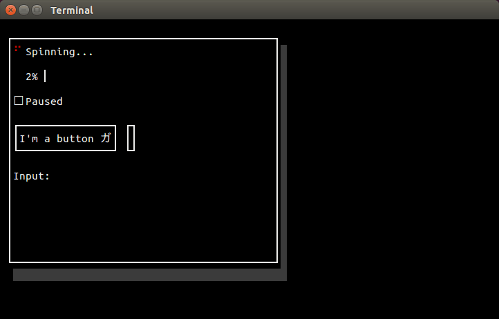

Glitter
=======

Makes your Rust project's user interface sparkle!

See `examples/demo.rs` for how to use the widgets that Glitter provides. 

Glitter currently provides buttons, checkboxes, frames, horizontal and
vertical layouts, input fields, progress bars, and spinners.
